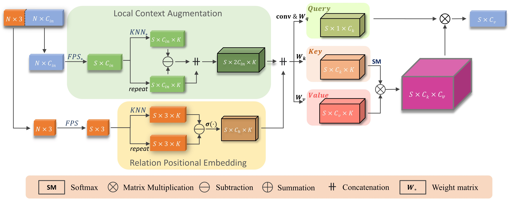

# 3DMedPT

**\[our code for IntrA and Modelnet40 classification is released]**

3D Medical Point Transformer: Introducing Convolution to Attention Networks for Medical Point Cloud
Analysis [[arxiv]](https://arxiv.org/pdf/2112.04863.pdf)

Author: Jianhui Yu, Chaoyi Zhang, Heng Wang, Dingxin Zhang, Yang Song, Tiange Xiang, Dongnan Liu, Weidong Cai

## Model Architecture



## Requirements

* Python >=3.6
* Pytorch >= 1.4
* Packages: tqdm, visualdl, einops, natsort

## Performance

* State-of-the-art accuracy on IntrA classification (F1 score): <b>0.936</b>
* State-of-the-art accuracy on IntrA segmentation (IoU): <b>94.82%</b> on healthy vessel and <b>82.39%</b> on aneurysm
* ModelNet40 classification: <b>93.4%</b>

## Citation

If you find our data or project useful in your research, please cite:

```
@article{yu20213d,
title={3D Medical Point Transformer: Introducing Convolution to Attention Networks for Medical Point Cloud Analysis},
author={Yu, Jianhui and Zhang, Chaoyi and Wang, Heng and Zhang, Dingxin and Song, Yang and Xiang, Tiange and Liu, Dongnan and Cai, Weidong},
journal={arXiv preprint arXiv:2112.04863},
year={2021}
}
```